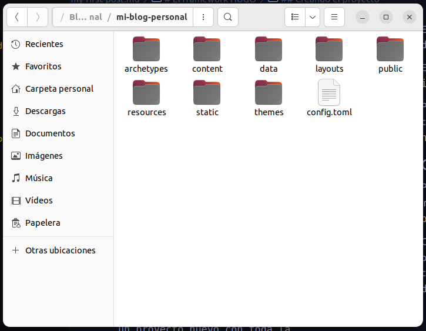
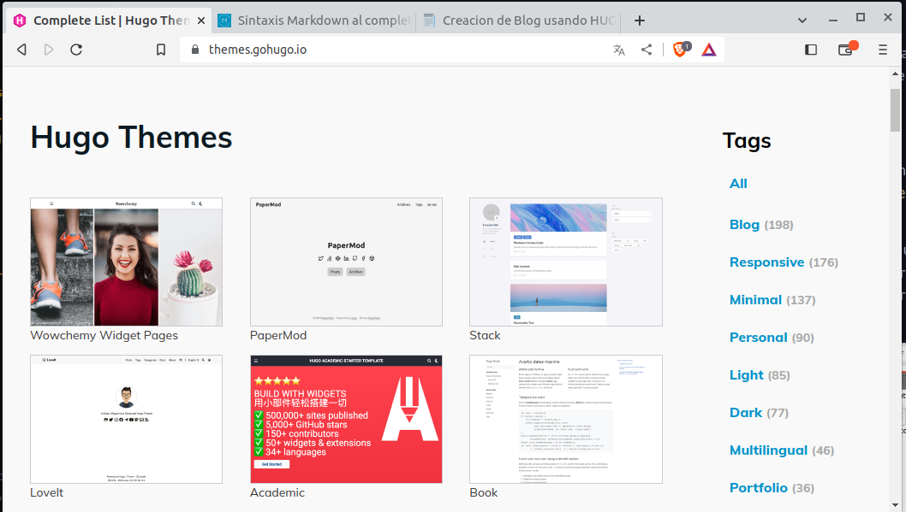
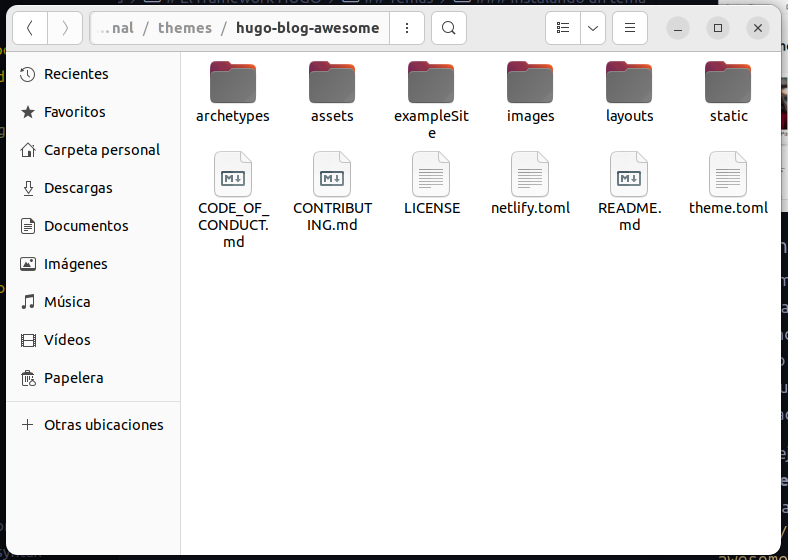

# El framework HUGO

## Instalación
Antes de poder comenzar con el desarrollo de nuestro proyecto es necesario instalar el framework en el equipo donde realizaremos nuestro desarrollo.

Todo lo necesario lo podemos conseguir en el sitio oficial del framework [HUGO](https://gohugo.io/). 

En el sitio se encuentra tambien toda la documentacion necesaria que puede consultarse incluida la seccion de [Instalacion](https://gohugo.io/installation/) con sub secciones para los diferentes sitemas operativos:
* [macOS](https://gohugo.io/installation/macos/)
* [Linux](https://gohugo.io/installation/linux/)
* [Windows](https://gohugo.io/installation/windows/)
* [BSD](https://gohugo.io/installation/bsd/)

En este ejemplo estamos utilizando linux con la distribucion Ubuntu (Derivacion de Debian).

En la consola ejecutamos el comando `sudo apt install hugo`.

Para confirmar si el framework esta instalado correctamente ejecutamos en la consola el comando `hugo version`.

## Creando el proyecto

Para crear un proyecto de HUGO 
ejecutamos la instruccion `hugo new site Nombre-de-proyecto` en la consola de comandos .

Como resultado obtenemos rapidamente un proyecto nuevo con toda la estructura, carpetas y configuraciones necesarias para comenzar a desarrollar nuestro blog.

## Temas
Una de las grandes bondades con que cuenta el framework HUGO es la utilizacion de temas prediseñados y preconfigurados para crear variados tipos de páginas como son blogs, portafolios, galerias entre otros. 

### Instalando un tema
La gran mayoria de los temas de hugo se encuentran almacenados y versionados en github, por lo que es recomendable y casi necesario versionar nuestro proyecto con git y descargar el tema como un submodulo para poder llevar seguimiento de las actualizaciones que el tema reciba.

En este ejemplo estamos utilizando el tema **Hugo blog awesome.** y lo descargamos mediante la sentencia `git submodule add https://github.com/hugo-sid/hugo-blog-awesome.git themes/hugo-blog-awesome`

El resultado es una subcarpeta llamada *hugo-blog-awesome* desntro de la carpeta *themes* con todo el contenido y subcarpetas necesarios. 

En este punto nuestro proyecto aun no esta utilizando el tema descargado, el siguiente paso consiste en indicar a nuestro proyecto que tema debe usar, esto lo realizamos editando el archivo **config.toml** y agregandole la linea `theme = "hugo-blog-awesome"`. 

Despues de este punto el tema ya esta asociado a nuestro proyecto, en algunos temas esta instruccion es suficiente para comenzar a trabajar; para el tema que estamos utilizando es necesario agregar al archivo de configuracion la siguiente informacion: 

~~~
defaultContentLanguage = "en-gb"

googleAnalytics = ''

enableEmoji = true

[markup]
  [markup.highlight]
    noClasses = false
  [markup.goldmark.renderer]
    unsafe = true

[menu]
  [[menu.main]] 
    `url` is optional; it will be used as a fallback if the page is not found.
    pageRef="/"
    name = 'Home'
    url = '/'
    weight = 10
  [[menu.main]]
    pageRef="posts"
    name = 'Posts'
    url = '/posts/'
    weight = 20
  [[menu.main]]
    pageRef="about"
    name = 'About'
    url = '/about/'
    weight = 30

[params]
  sitename = "Awesome hugo blog"
  defaultColor = "dark" # set color mode: dark, light, auto
  description = "Minimal Hugo blog theme with light and dark mode support"
  mainSections = ['posts']

[params.author]
  avatar = "avatar.jpg" # put the file in assets folder; also ensure that image has same height and width
  intro = "Awesome hugo blog"
  name = "Sidharth R"
  description = "A fast, minimalistic Hugo theme with light and dark mode support, for running a personal site or blog"

[[params.socialIcons]]
name = "github"
url = "https://github.com/hugo-sid"

[[params.socialIcons]]
name = "twitter"
url = "https://twitter.com"

[[params.socialIcons]]
name = "Rss"
url = "index.xml"
~~~